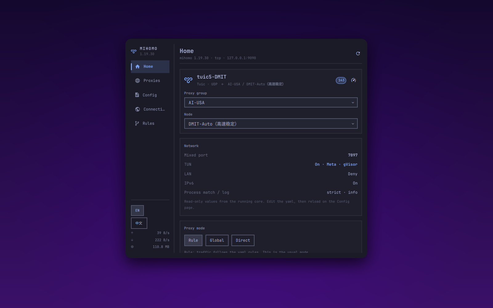

# Mihomo



Omarchy bar plugin: a control panel for the mihomo core. Left nav rail plus a
right-hand page, covering **Home / Proxies / Config / Connections / Rules**.

Talks to mihomo's external controller (REST API) directly. It does **not**
depend on Clash Verge or any other GUI client. The core alone is enough.

The UI defaults to **English**. Switch to Chinese with the EN / 中文 buttons
in the sidebar or on the Config page.

License: MIT. See [LICENSE](LICENSE).

## Install

```sh
omarchy plugin add https://github.com/lijiawei0305-pixel/omarchy-mihomo-plugin.git --enable
omarchy bar move io.github.lijiawei0305-pixel.mihomo --section right
```

That clones the repo, validates `manifest.json`, and enables the plugin. It
does not run an installer and does not ask for elevated privileges.

## Remove

```sh
omarchy plugin remove io.github.lijiawei0305-pixel.mihomo
```

That disables the widget and deletes the plugin checkout. Language preference
in `~/.config/omarchy-mihomo/ui` is left in place; delete that file yourself
if you want it gone.

## Dependencies

- `bash` and `curl` (used by `bin/mihomo-ctl` to talk to the core)
- A running [mihomo](https://github.com/MetaCubeX/mihomo) core with its
  external controller enabled (the default)

The plugin does not install mihomo and does not write your yaml. It can switch
**system proxy** (desktop + session environment) and **TUN** from the Home page.
Those two toggles are independent: turning one off does not change the other.

## Pages

| Page | What it shows | APIs |
|------|----------------|------|
| Home | Current node, system proxy / TUN capture, how to link the core, network overview, proxy mode, traffic | `/version` `/configs` `/proxies` `/traffic` `/memory` plus OS proxy |
| Proxies | Proxy groups, expand nodes, switch, group or single-node latency tests | `/proxies` `/proxies/{name}` `/group/{name}/delay` |
| Config | Hand-written yaml path / stats, reload the core, open the editor; rule providers can be refreshed | `configinfo` `PUT /configs` `/providers/rules` |
| Connections | Active connections, up/down, chain and matched rule; filter, close one, close all | `/connections` |
| Rules | Every rule from the config; filter by domain / type / target | `/rules` |

Writes (switch node, switch mode, latency test, close connections, update a
provider, enable TUN) go to the running core. Other front-ends see the same
state. System proxy is written to the OS, the same way
[Clash Verge Rev](https://github.com/clash-verge-rev/clash-verge-rev) does on
Linux (`gsettings` / `dconf`), plus the systemd user environment Hyprland
reads.

## Language

Default is English. The EN / 中文 switch is in the sidebar footer and on the
Config page. The choice is stored in `~/.config/omarchy-mihomo/ui` and survives
restarts:

```
language = en
sysproxy = off
```

Use `zh` for Chinese. `sysproxy = on` means this plugin last turned the OS
proxy on, so a mixed-port change can rewrite it.

## Link the core

The panel does not start mihomo. Run your own core, then expose its API.

In the core yaml:

```yaml
external-controller: 127.0.0.1:9090
# secret: your-secret
```

**9090** (or whatever you set as `external-controller`) is only for this panel.
Apps use **mixed-port** or TUN. Home shows the live API, yaml path, and mixed
port, plus a one-line yaml example.

The panel never hardcodes an address. Every `bin/mihomo-ctl` call probes in
order and uses the first hit:

1. `~/.config/omarchy-mihomo/config` — manual override
2. Flags on the running core — `-ext-ctl` / `-ext-ctl-unix` / `-secret`
3. The yaml that core was started with — `external-controller` / `external-controller-unix` / `secret`
4. `127.0.0.1:9090`, no secret — mihomo's default

So it finds the core whether it listens on a TCP port or a Unix socket, with or
without a secret.

If the port or secret is not the default, create
`~/.config/omarchy-mihomo/config`:

```
endpoint = 127.0.0.1:9090
# or a unix socket:
# socket = /run/mihomo/mihomo.sock
secret = your-secret
```

The yaml `secret:` and this file must match. Check what was resolved:

```sh
~/.config/omarchy/plugins/io.github.lijiawei0305-pixel.mihomo/bin/mihomo-ctl endpoint
```

## Keyboard

With the panel open (`Esc` closes, `Tab` moves to the next panel):

| Key | Action |
|-----|--------|
| `1` – `5` | Jump to Home / Proxies / Config / Connections / Rules |
| `←` `→` `h` `l` | Previous / next page |
| `↑` `↓` `j` `k` | Scroll the current page |
| `/` | Focus the filter (Connections, Rules) |
| `r` | Refresh the current page |

On the Proxies page, left-click a node to switch, right-click to test that
node's latency.

## Notes

- On Home, **System proxy** and **TUN** toggle on their own. Off clears both.
  TUN captures everything; system proxy only the apps that honour it. Ports,
  LAN and IPv6 stay read-only; edit the yaml and reload for those.
- System proxy points HTTP/HTTPS/SOCKS at the mixed port (or HTTP / SOCKS if
  mixed is off) and bypasses `localhost`, `127.0.0.1`, RFC1918 ranges and
  `::1`, matching Clash Verge's Linux default.
- TUN is `PATCH /configs` with `tun.enable`. The core needs `cap_net_admin`
  (or to run as root). A failure shows as a toast; the plugin does not install
  a privileged helper.
- Only `Selector` groups accept a manual node. `URLTest` / `Fallback` /
  `LoadBalance` are chosen by the core, and the API rejects a forced pick.
- The Config page is that handwritten yaml. Nodes live under `proxies:`; there
  is no subscription fetch. Rule providers can still be refreshed by hand.
  After you save the file, use **Reload config** — no service restart needed.
- While the panel is closed it only does a light poll every 30 seconds. Opening
  it starts the `/traffic` and `/memory` streams and fetches whatever the
  current page needs.

## Development

The repo is the source of truth. After an edit:

```sh
./deploy
```

That validates the manifest, syncs to
`~/.config/omarchy/plugins/io.github.lijiawei0305-pixel.mihomo/`, and restarts
the shell. Hot reload is unreliable; a restart is the sure way.

```sh
omarchy plugin validate .
omarchy-shell io.github.lijiawei0305-pixel.mihomo open
```
